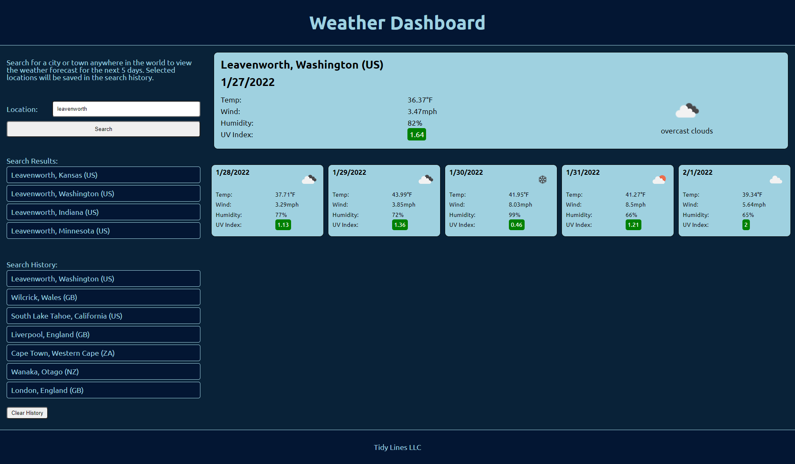

# weather-dashboard
A dashboard for viewing upcoming weather by city

## Application Details
This application showcases a responsive, mobile first design and leverages JavaScript to make two separate calls to OpenWeatherMap.org APIs to allow a user to pull back a 5 day weather forecase for any worldwide location. Searches return 5 results that the user can select from and a search history is saved locally for easy access to preivously viewed locations. 

## Links
The deployed website can be found [here](https://benfok.github.io/weather-dashboard/)

The repository in GitHub is [here](https://github.com/benfok/weather-dashboard)

## Languages, Skills and Credits
- HTML
- CSS
- JavaScript
- Google Fonts
- : Geocoding API to pull location data
- : OneCall API to pull current and extended forecast data 

## Screenshot
Here is a screenshot of my finished page. Some key details and learnings are below.

## Details and Learnings
- I needed to leverage two API calls, one to return locations based on the search string and the second to pull the weather by entering the location's coordinates
- It was important to handle errors, blank searches and searches with no results returned appropriately
- I leveraged inline styles and adjusting classes to trigger the display on and off for certain components on the page. This lead to a really clean design, with information displayed only as it became relevant to the user
- The page is responsive across multiple breakpoints
- I stored list items as an array converted into a string for local storage, and then back into a string to insert as innerHTML to dynamically create the search history
- When list items were created either through search results or history I needed to recall the function to activate event listeners on these items, so that the user could click them to show the weather

## Future Enhancements
Ideas for how to enhance the application:
- Potentially call the search location API on or after a certain number of keystrokes using a drop down, to reduce the step of generating and then clicking on a list
- Rather than simply saving the most recently viewed locations, offer the user the opportunity to save favorites
- The icons pulled from OpenWeatherMap.org are challenging to display with certain backgrounds. Explore different more UX friendly icon options
- Add more weather data such as precipitation

